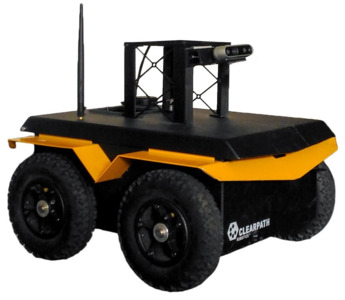

# Vision-based off-road navigation with geographical hints

## Summary

| Company name | [Milrem Robotics](https://milremrobotics.com/) |
| :--- | :--- |
| Project Manager | Meelis Leib |
| Systems Architect | Erik Ilbis |

| Company name | [Autonomous Driving Lab](https://adl.cs.ut.ee/), [Institute of Computer Science](https://cs.ut.ee/), [University of Tartu](https://ut.ee/) |
| :--- | :--- |
| Team lead | [Tambet Matiisen](https://www.etis.ee/CV/Tambet_Matiisen/eng) |
| Data collection | Kertu Toompea |
| Model training | Romet Aidla |
| Robot integration | Anish Shrestha |
| Map preparation | Edgar Sepp |

## Objectives of the Demonstration Project

The goal of the project is to collect and validate dataset for vision-based off-road navigation with geographical hints.

Milrem UGV needs to be able to navigate:
* in unstructured environment (no buildings, roads or other landmarks),
* with passive sensors (using only camera and GNSS, active sensors make the UGV discoverable to the enemy),
* with no prior map or with outdated map,
* with unreliable satellite positioning signals.

System that satisfies the above goals was proposed in the [ViKiNG paper](https://sites.google.com/view/viking-release) by Dhruv Shah and Sergey Levine from University of California, Berkeley. The paper demonstrated vision-based kilometer-scale navigation with geographical hints in semi-structured urban environments, including parks. The goal of this project was to extend the ViKiNG solution to unstructured off-road environments, for example forests.

Examples of desired environment:

| | | |
|-|-|-|
|  |  |  |

## Activities and results of demonstration project

### Challenge adressed

The goal of using passive sensors means that the camera is the primary sensor. The currently best known way to make sense of camera images is to use artificial neural networks. These networks need a lot of training data to work well. Therefore the main goal of this project was to collect and validate the data to train artificial neural networks for vision-based navigation.

We set ourselves a goal to collect 50 hours of data consisting of 150 km of trajectories. This was inspired by the ViKiNG paper having 42 hours of training data. Time-wise this goal was achieved, distance-wise 104 km was collected.

In addition to collecting the data we wanted to validate if it is usable for training the neural networks. We actually went further than that by not only training the networks, but also implementing a proof-of-concept navigation system on [Jackal robot](https://clearpathrobotics.com/jackal-small-unmanned-ground-vehicle/).

### Data sources

The data was collected from April 12th till October 6th, 2023 from 27 orienteering events and 20 self-guided sessions around Tartu, Estonia. Details of the places and weather conditions can be found in [this table](https://docs.google.com/spreadsheets/d/1QvA2ZYTeZOpk7b1DCHypi17wS-ywxv5n0ifdOzRoi_o/edit?usp=sharing).

Data collection was performed with golf trolley fitted with following sensors:
* [ZED 2i](https://www.stereolabs.com/products/zed-2) stereo camera
* [Xsens MTI-710G](https://www.movella.com/products/sensor-modules/xsens-mti-g-710-gnss-ins) GNSS/INS device
* 3x [GoPro cameras](https://gopro.com/en/us/shop/cameras/hero12-black/CHDHX-121-master.html) at three different heights

| | | | |
|-|-|-|-|
|  |  |  |  |

Four different types of data was collected:
1. camera images,
2. visual odometry (trajectories derived from camera movement),
3. GPS trajectories,
4. georeferenced maps.

Following types of maps were acquired and georeferenced:

| Map type | Example image |
| -------- | ------------- |
| orienteering maps (usually from organizers, sometimes from [Estonian O-Map](https://okaart.osport.ee/)) |  |
| [Estonian base map](https://geoportaal.maaamet.ee/eng/Spatial-Data/Topographic-Maps/Estonian-Basic-Map-1-10-000-p306.html) (from [Estonian Land Board](https://maaamet.ee/en)) |  |
| [Estonian base map](https://geoportaal.maaamet.ee/eng/Spatial-Data/Topographic-Maps/Estonian-Basic-Map-1-10-000-p306.html) with elevation (from [Estonian Land Board](https://maaamet.ee/en)) |   |
| [Estonian orthophoto](https://geoportaal.maaamet.ee/eng/Spatial-Data/Orthophotos-p309.html) (from [Estonian Land Board](https://maaamet.ee/en)) |  |
| Google satellite photo (from [Google Maps Static API](https://developers.google.com/maps/documentation/maps-static/start)) |  |
| Google road map (from [Google Maps Static API](https://developers.google.com/maps/documentation/maps-static/start)) |  |
| Google hybrid map (from [Google Maps Static API](https://developers.google.com/maps/documentation/maps-static/start)) |  |

Further cleaning was applied to the data with following sections removed:
* Missing odometry data
* Big change in position: >1.0m per timestep
* Low velocity: <0.05 m/s
* High velocity: >2.5 m/s
* Model prediction errors were analyzed
* Bad trajectories
* Missing or bad camera images

Altogether this resulted in 94.4 km of trajectories used for training.

In addition the dataset for local planner was combined with [RECON dataset](https://sites.google.com/view/recon-robot/dataset) of 40 hours of autonomously collected trajectories.

### Description of AI technology

The system makes use of two neural networks: local planner and global planner.

**Local planner** takes a camera image and predicts next waypoints, where the robot can drive without hitting obstacles. 

| Inputs to the model | Outputs of the model |
| ------------------- | -------------------- |
| <ul><li>Current camera image</li><li>Past 5 camera images for context</li><li>Goal image</li></ul> | <ul><li>Trajectory of 5 waypoints</li><li>Temporal distance to the goal</li></ul> |

The local planner is trained using camera images and visual odometry. The goal image was taken as an image from fixed timesteps from the future. Temporal distance to the goal represents the number of timesteps to the goal image.

**Global planner** takes the waypoints proposed by the local planner and estimates which of them are likely on the path to the final goal.

| Inputs to the model | Outputs of the model |
| ------------------- | -------------------- |
| <ul><li>Overhead map</li><li>Current location</li><li>Goal location</li></ul> | <ul><li>Probabilities whether each map pixel is on the path from current location to goal</li></ul> |

The global planner is trained using georeferenced maps and GPS trajectories - given two points on the trajectory, all points in-between were marked as high-probability points.

These two models work in coordination to handle outdated maps and inaccurate GPS:
* as long as the local planner proposes valid waypoints the robot never collides with obstacles,
* as the global planner picks waypoints which are on the path to the final destination, it tends to move towards the final goal, even if the GPS positioning is wrong or the map is outdated.

### Results of validation

#### Local planner

For local planner following network architectures were considered:
| Model | Pretrained weights | Trained or finetuned | On-policy tested | Generative | Waypoint proposal method |
|-------|--------------------|----------------------|------------------|------------|--------------------------|
| [VAE](https://sites.google.com/view/viking-release) | - | + | + | + | Sampling from latent representation |
| [GNM](https://sites.google.com/view/drive-any-robot) | + | + | + | - | Cropping the current observation |
| [ViNT](https://general-navigation-models.github.io/vint/index.html)  | + | - | + | + | Goal image diffusion |
| [NoMaD](https://general-navigation-models.github.io/nomad/index.html) | + | - | - | + | Trajectory diffusion |

VAE model was trained from scratch, all other models were used with pre-trained weights from Berkeley group. GNM model was additionally fine-tuned with our own dataset.

The models were tested both off-policy and on-policy. Off-policy means that the model was applied to recorded data, the model's actions were just visualized, but not actuated. On-policy means that the model’s actions were actually actuated on the robot.

For on-policy testing we recorded a fixed route, took goal images at fixed intervals and measured success rate in navigating to every goal image along the route. Basically it shows how well the model understands the direction of goal image and how well detect it can detect if the goal was reached. The operator intervened when the robot was going completely off the path and guided it back to the track. Sometimes the robot failed to detect the goal, but was driving in the right direction and successfully recognized the subsequent goal. Then the goal was not marked as achieved, but no intervention was necessary.

##### Off-policy results

The videos below show models applied to pre-recorded data. In the videos green trajectory represents ground truth, red trajectory represents goal-conditioned predicted trajectory (many in case of NoMaD), blue represents sampled possible trajectories (in case of VAE).

| Model | Video |
| ----- | ----- |
| VAE |  |
| GNM finetuned |  |
| ViNT |  |
| NoMaD with goal images at fixed intervals |  |
| NoMaD with one fixed goal (exploratory mode) |  |
| NoMaD orienteering |  |

##### On-policy results indoors

We recorded a fixed route in Delta office with goal images every 1 or 2 meters and measured the goal success rate for each interval.

| Model | Goal interval | Number of goal images | Number of interventions | Success rate | Video |
|-------|---------------|-----------------------|-------------------------|--------------|-------|
| GNM | 1m | 30 | 0 | 90.00 | [video](https://drive.google.com/file/d/1fKsaQo0beNpOcQ4xfqAF1RfVevhw57Ne/view?usp=drive_link) |
| GNM finetuned | 1m | 30 | 1 | 93.33 | [video](https://drive.google.com/file/d/1-NNzsXL4chn6ZxIgDQxeHjIHp1OUBnzg/view?usp=drive_link) |
| ViNT | 1m | 30 | 2 | 96.67 | [video](https://drive.google.com/file/d/1CkjuG037wp3DgFgFsC0gsZ2YhntCocFT/view?usp=drive_link) |
| GNM | 2m | 15 | 0 | 86.67 | [video](https://drive.google.com/file/d/1l7yI73b3bl7qxeJAT8gBtkWD8RsFvHhB/view?usp=drive_link) |
| GNM finetuned | 2m | 15 | 0 | 93.33 | [video](https://drive.google.com/file/d/1kHIW5LfpA2eoPawgp5HJprsbevPLBXgg/view?usp=drive_link) |
| ViNT | 2m | 15 | 0 | 93.33 | [video](https://drive.google.com/file/d/19egUyGQgr0efxUop5Jl9mVbd9vws7GYe/view?usp=drive_link) |

Example video of top-performing model (GNM-finetuned) at 4X speed:

##### On-policy results outdoors

We recorded a fixed route in Delta park with goal images every 2, 5 or 10 meters and measured the goal success rate for each interval.

| Model | Goal interval | Number of goal images | Number of interventions | Success rate | Video |
|-------|---------------|-----------------------|-------------------------|--------------|-------|
| GNM | 2m | 38 | 1 | 86.84 | [video](https://drive.google.com/file/d/1THqJDbQeXrH3yAH98Jy1UvMSAvmHvKRD/view?usp=drive_link) |
| GNM finetuned | 2m | 38 | 0 | 81.58 | [video](https://drive.google.com/file/d/1RrYOHmaVN1zyfmtP1UQVwqDBxuR-d5Fg/view?usp=drive_link) |
| GNM finetuned | 5m | 17 | 7 | 100 | [video](https://drive.google.com/file/d/1TtaI7RH3j7aUPrn-sAqzkGkmKGm0Hzrx/view?usp=drive_link) |
| ViNT | 5m | 17 | 7 | 100 | [video](https://drive.google.com/file/d/1lvwFo9fWuyTr2sdfYbFnmEqpWYJFSFrI/view?usp=drive_link) |
| ViNT | 10m | 8 | 9 | 100 | [video](https://drive.google.com/file/d/1xMCT0IKqcBXsGmMsip_OuUuiqeQfT7VM/view?usp=drive_link) |

Example video of top-performing model (GNM-finetuned) at 4X speed:

#### Global planner

For global planner following network architectures were considered:
* [contrastive MLP](https://sites.google.com/view/viking-release)
* [U-Net](https://arxiv.org/abs/1505.04597)

As the U-Net approach worked much better, the contrastive approach was abandoned. Most of the experimentation was done with the base map with elevation. 

Following videos show on-policy simulation where the robot proposes a number of random waypoints and then moves towards the one that has the highest probability. Blue dot shows the robot current location and yellow dot is the goal location.

| Location | Video |
| -------- | ----- |
| Ihaste |  |
| Kärgandi, sticking to the road |  |
| Annelinn, avoidance of houses |  |

Following videos show different behavior for different map modalities.

| Location | Video |
| -------- | ----- |
| Base map - sticking to the road |  |
| Road map - going straight (not enough context) |  |
| Orthophoto - mostly sticking to the road |  |

#### Putting it all together

Following video shows off-policy evaluation of the whole system on a recorded session. Colored trajectories are produced with crops of the original camera image used as goal, as shown in the video. White trajectory comes from the final goal. 

On-policy evaluation of the whole system was not possible due to some technical difficulties with the GNSS sensor and due to winter making the use of the models pointless, because they were mainly trained on summer data.

### Technical architecture

For local planner following network architectures were tried:
* VAE (as in the original [ViKiNG paper](https://sites.google.com/view/viking-release))

  

* [GNM](https://sites.google.com/view/drive-any-robot)

  

* [ViNT](https://general-navigation-models.github.io/vint/index.html)

  

* [NoMaD](https://general-navigation-models.github.io/nomad/index.html)

  

For global planner following network architectures were tried:
* contrastive MLP (as in the original [ViKiNG paper](https://sites.google.com/view/viking-release))

  

* [U-Net](https://arxiv.org/abs/1505.04597)

  

### Potential areas of use

The working solution could be used in any area that needs navigation in unstructured environment with poor GPS signal and outdated maps, for example:
* military,
* agriculture,
* forestry,
* rescue.

The dataset collected in this project can also be used to create a visual navigation benchmark and international robot orienteering competition. Such competition would make novel solutions and international talent accessible to Milrem Robotics.

### Lessons learned

For training the local planner the dataset seemed insufficient or contained too simple trajectories (moving mostly forward). Even after combining our data with RECON dataset or fine-tuning existing models, the results were inconclusive - sometimes the fine-tuned model was performing better, sometimes worse than the original. The original general navigation models were also unreliable, they were not always able to avoid the obstacles. More work is needed to make visual navigation reliable.

Alternative model outputs could be considered, e.g. predicting free space instead of trajectories and proposing waypoints from that free space. Also collection of more explorative data directly with the robot might be necessary, as in the ViKiNG paper they used mainly automatically collected exploratory data (30 hours) and relatively few expert trajectories (12 hours). In our case all of the data was expert trajectories.

Global planner trained much better and was able to estimate reasonably well the recommended path between two points. We also observed different behavior for different map modalities, e.g. base map and road map. More work is needed to reduce the artifacts produced by the fully convolutional network and some map modalities might need further tuning.

Final takeaways:
* Training neural networks in 2023 is still hard.
* Dataset curation is non-trivial and less documented than model training.
* Should use (or fine-tune) pre-trained models whenever available.
* Off-policy performance (on recordings) does not match on-policy performance (on robot).

### Description of User Interface 

* The screen shows current camera image and proposed trajectories. White trajectory represents the trajectory induced by the goal image at top right.
* Bottom right shows the probability map (the path from current position to goal) and original map. Waypoint colors match the trajectory colors. 
* The left pane shows the robot command.
